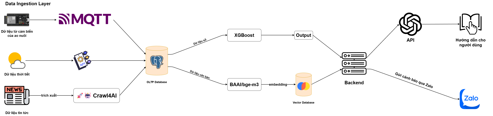

# Aqua Sentinel - YDCC 2025 Submission

Chào mừng đến với repository của dự án **Aqua Sentinel**. Đây là giải pháp tham dự cuộc thi **Youth Digital Citizen Challenge (YDCC) 2025**.


## 1. Problem Statement (Vấn đề cần giải quyết)

Trong nuôi trồng thủy sản (đặc biệt là tôm và cá tra tại ĐBSCL), chất lượng nước là yếu tố sống còn. Người nông dân thường gặp khó khăn trong việc:
- **Theo dõi liên tục**: Các chỉ số nước (pH, Oxy hòa tan, NH3, v.v.) biến động nhanh, việc đo thủ công không đáp ứng kịp.
- **Dự báo rủi ro**: Thiếu công cụ cảnh báo sớm về các biến động bất thường hoặc dịch bệnh tiềm ẩn.
- **Ra quyết định**: Thiếu kiến thức chuyên sâu để xử lý tình huống khẩn cấp dựa trên dữ liệu đo được.

## 2. Solution Overview (Tổng quan giải pháp)


**Aqua Sentinel** là hệ thống giám sát và quản lý rủi ro thông minh cho ao nuôi thủy sản. Giải pháp kết hợp giữa giám sát thời gian thực và trí tuệ nhân tạo (AI) để:
1.  **Thu thập dữ liệu**: Mô phỏng/Kết nối cảm biến IoT để lấy chỉ số môi trường 24/7.
2.  **Dự báo (Forecasting)**: Sử dụng thuật toán để dự đoán xu hướng biến đổi chất lượng nước trong tương lai gần (30 - 60 phút).
3.  **Tư vấn thông minh (AI Consultant)**: Tích hợp LLM (Large Language Model) để phân tích dữ liệu tổng hợp và đưa ra lời khuyên hành động cụ thể cho người nông dân (ví dụ: "Bật quạt nước ngay", "Giảm lượng thức ăn").

## 3. Các tính năng chính (Key Features)

- **Dashboard giám sát Real-time**: Hiển thị trực quan các chỉ số quan trọng (Temperature, DO, pH, Turbidity, Ammonia).
- **Hệ thống cảnh báo rủi ro**: Phân loại mức độ rủi ro (An toàn, Cảnh báo, Nguy hiểm) dựa trên ngưỡng chịu đựng của từng loài (Tôm, Cá, Cua...).
- **AI Phân tích & Khuyến nghị**: Tự động sinh báo cáo và hướng dẫn xử lý dựa trên dữ liệu hiện tại và tin tức môi trường.
- **Quản lý đa hồ nuôi**: Hỗ trợ quản lý nhiều ao/hồ trên cùng một tài khoản.
- **Data Simulation**: Module giả lập dữ liệu môi trường chân thực để phục vụ demo và kiểm thử hệ thống.

## 4. Tech Stack & Architecture Notes

### Công nghệ sử dụng
- **Frontend**: [Angular v21](https://angular.io/) (Material Design, Chart.js).
- **Backend API**: [Python FastAPI](https://fastapi.tiangolo.com/).
- **Database**: PostgreSQL.
- **AI/ML**: 
  - Time-series forecasting (Custom logic/Statistical methods).
  - LLM Integration (OpenAI/Gemini via Proxy) cho phân tích ngữ nghĩa.
- **DevOps/Infrastructure**: Docker, Docker Compose.

### Kiến trúc hệ thống
Hệ thống được thiết kế theo kiến trúc Microservices đơn giản hóa:
1.  **Frontend**: Ứng dụng Web tương tác với người dùng.
2.  **Backend Core**: API Server xử lý logic nghiệp vụ, xác thực (Auth) và quản lý dữ liệu.
3.  **Simulation Service**: Dịch vụ độc lập sinh dữ liệu giả lập theo chu kỳ (Random walk + Mean reversion) để "nuôi" database.
4.  **Database**: Lưu trữ trung tâm (Time-series data & User data).

## 5. Setup & Installation (Cài đặt)

### Prerequisites (Yêu cầu môi trường)
- **Docker & Docker Compose** (Khuyến nghị cho Backend & Database).
- **Node.js** (v18+) & **npm** (cho Frontend).
- **Python 3.10+** (nếu chạy local backend).

### Các bước cài đặt

#### B1: Clone Repository
```bash
git clone https://github.com/hugobatu/YDCC_Hackathon.git
cd YDCC_Hackathon
```

#### B2: Cấu hình biến môi trường
Tạo file `.env` từ file mẫu trong thư mục `aqua-sentinel` và `simulation`:
```bash
cp aqua-sentinel/.env.example aqua-sentinel/.env
cp simulation/.env.example simulation/.env
```
*Lưu ý: Cập nhật các thông tin kết nối DB và API Key nếu cần.*

#### B3: Khởi chạy Backend & Simulation (bằng Docker)
Cách nhanh nhất để dựng toàn bộ hệ thống server và database:
```bash
cd aqua-sentinel
docker-compose up -d --build
```
Lệnh này sẽ khởi tạo:
- Backend API (`localhost:8000`).

#### B4: Cài đặt và chạy Frontend
```bash
cd ../frontend
npm install
ng serve
```
Truy cập ứng dụng tại: `http://localhost:4200`

## 6. Run Instructions & User Guide

### Chạy hệ thống (Local)
1.  Đảm bảo các container Docker (API & DB) đang chạy (kiểm tra bằng `docker ps`).
2.  Đảm bảo Frontend đang chạy tại port 4200.

### Hướng dẫn sử dụng cơ bản
1.  **Đăng ký/Đăng nhập**: Tạo tài khoản mới để truy cập hệ thống.
2.  **Tạo hồ nuôi**: Vào mục quản lý hồ, thêm hồ mới, chọn loài (Tôm/Cá) và Vùng nuôi.
3.  **Xem Dashboard**: Chọn một hồ để xem biểu đồ chất lượng nước thời gian thực.
4.  **Nhận tư vấn AI**: Bấm vào nút "Phân tích AI" hoặc "AI Consultant" để xem đánh giá chi tiết về tình trạng hồ và các khuyến nghị.

## 7. Attribution & Licensing

### Third-party Resources
- **Angular Material** & **Chart.js**: UI Framework và thư viện biểu đồ.
- **FastAPI**: Backend framework.
- Các thư viện Python khác được liệt kê trong `requirements.txt`.

### AI Usage Disclaimer
Dự án có sử dụng sự hỗ trợ của AI Agent trong quá trình phát triển:
- **Code Assistance**: Một phần mã nguồn (boilerplate, unit tests, simulation logic) được tạo ra với sự hỗ trợ của các công cụ AI Coding Assistant (Github Copilot/Cursor/Gemini) và được review/chỉnh sửa bởi con người.
- **AI Features**: Tính năng "AI Consultant" sử dụng LLM API của OpenAI để sinh nội dung.

### License
Dự án được thực hiện cho cuộc thi YDCC 2025. Mọi mã nguồn thuộc quyền sở hữu của nhóm phát triển.